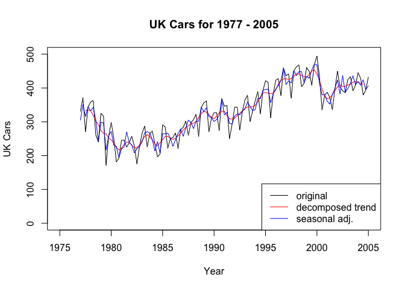
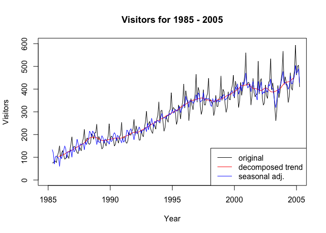
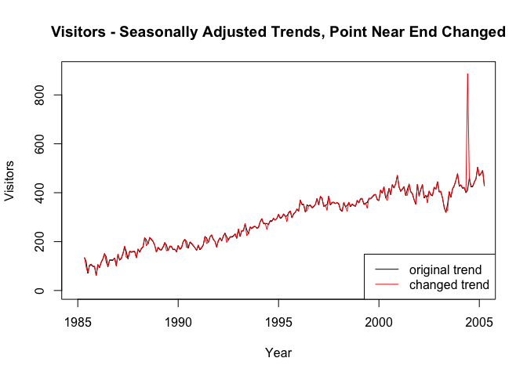

# BGobran_LiveSessionUnit11Assignment
Brian Gobran Section 403  
11/18/2016  


#### Introduction:
###### This is the R code to perform Live Session Unit 11 Assignment
###### This is a time-series exercise with three different datasets
###### Instead of just doing the one our group was assigned (ukcars), I am going to do all three since it is all fairly straightforward.


###### Load the library we might need, bring in the data, see what it is


```r
library(fpp)
```

```
## Loading required package: forecast
```

```
## Loading required package: zoo
```

```
## 
## Attaching package: 'zoo'
```

```
## The following objects are masked from 'package:base':
## 
##     as.Date, as.Date.numeric
```

```
## Loading required package: timeDate
```

```
## This is forecast 7.3
```

```
## Loading required package: fma
```

```
## Loading required package: tseries
```

```
## Loading required package: expsmooth
```

```
## Loading required package: lmtest
```

```r
data(ukcars)
str(ukcars)
```

```
##  Time-Series [1:113] from 1977 to 2005: 330 371 271 344 358 ...
```

```r
data(visitors)
str(visitors)
```

```
##  Time-Series [1:240] from 1985 to 2005: 75.7 75.4 83.1 82.9 77.3 ...
```

```r
data(hsales)
str(hsales)
```

```
##  Time-Series [1:275] from 1973 to 1996: 55 60 68 63 65 61 54 52 46 42 ...
```

#### 1 a -- Plot the time series, look for seasonal fluctuations or a trend


```r
plot(ukcars, type="l", xlab = "Year", xlim=c(1975,2005), ylab = "UK Cars", ylim=c(0,500), main = "UK Cars for 1977 - 2005")
```

<!-- -->

```r
plot(visitors, type="l", xlab = "Year", xlim=c(1985,2005), ylab = "Visitors", ylim=c(0,600), main = "Visitors for 1985 - 2005")
```

<!-- -->

```r
plot(hsales, type="l", xlab = "Year", xlim=c(1970,2000), ylab = "HSales", ylim=c(0,100), main = "HSales for 1973 - 1996")
```

<!-- -->

##### Honestly, I really can't identify trends or seasonal fluctuations from these data from these graphs


#### 1 b -- Perform a classical decomposition


```r
fitukcars <- decompose(ukcars)
fitvisitors <- decompose(visitors)
fithsales <- decompose(hsales)
```

#### 1 c -- Does this match what we saw in 1a?
##### I will plot these to see


```r
plot(fitukcars)
```

<!-- -->

```r
plot(fitvisitors)
```

<!-- -->

```r
plot(fithsales)
```

<!-- -->


##### Wow, I never would have seen these seasonal trends in the raw data


#### 1 d -- Compute and plot the seasonally adjusted data
##### Here I am graphing, for all three data sets, the original data (black), the decomposed trend (red), and the seasonally adjusted (blue) data


```r
adjukcars <- seasadj(fitukcars)
plot(ukcars, type="l", xlab = "Year", xlim=c(1975,2005), ylab = "UK Cars", ylim=c(0,500), main = "UK Cars for 1977 - 2005")
lines(fitukcars$trend, type="l", col="red")
lines(adjukcars, type="l", col="blue")
legend("bottomright", lty=1, col=c("black","red","blue"),c("original","decomposed trend","seasonal adj."))
```

<!-- -->

```r
adjvisitors <- seasadj(fitvisitors)
plot(visitors, type="l", xlab = "Year", xlim=c(1985,2005), ylab = "Visitors", ylim=c(0,600), main = "Visitors for 1985 - 2005")
lines(fitvisitors$trend, type="l", col="red")
lines(adjvisitors, type="l", col="blue")
legend("bottomright", lty=1, col=c("black","red","blue"),c("original","decomposed trend","seasonal adj."))
```

<!-- -->

```r
adjhsales <- seasadj(fithsales)
plot(hsales, type="l", xlab = "Year", xlim=c(1970,2000), ylab = "HSales", ylim=c(0,100), main = "HSales for 1973 - 1996")
lines(fithsales$trend, type="l", col="red")
lines(adjhsales, type="l", col="blue")
legend("bottomright", lty=1, col=c("black","red","blue"),c("original","decomposed trend","seasonal adj."))
```

<!-- -->


#### 1 e -- Make one point an outlier and see what that does to the seasonally adjusted data
##### In this case, I am choosing a point at middle to make an outlier
##### then I am making a graph showing the before and after seasonally adjusted result


```r
length(ukcars)
```

```
## [1] 113
```

```r
length(visitors)
```

```
## [1] 240
```

```r
length(hsales)
```

```
## [1] 275
```

```r
ukcars[57] <- ukcars[57] + 500
visitors[120] <- visitors[120] + 500
hsales[138] <- hsales[138] + 500

fitukcars2 <- decompose(ukcars)
adjukcars2 <- seasadj(fitukcars2)

fitvisitors2 <- decompose(visitors)
adjvisitors2 <- seasadj(fitvisitors2)

fithsales2 <- decompose(hsales)
adjhsales2 <- seasadj(fithsales2)

plot(adjukcars, type="l", xlab = "Year", xlim=c(1975,2005), ylab = "UK Cars", ylim=c(0,800), main = "UK Cars - Seasonally Adjusted Trends, Middle Point Changed")
lines(adjukcars2, type="l", col="red")
legend("bottomright", lty=1, col=c("black","red"),c("original trend","changed trend"))
```

<!-- -->

```r
plot(adjvisitors, type="l", xlab = "Year", xlim=c(1985,2005), ylab = "Visitors", ylim=c(0,800), main = "Visitors - Seasonally Adjusted Trends, Middle Point Changed")
lines(adjvisitors2, type="l", col="red")
legend("bottomright", lty=1, col=c("black","red"),c("original trend","changed trend"))
```

<!-- -->

```r
plot(adjhsales, type="l", xlab = "Year", xlim=c(1970,2000), ylab = "HSales", ylim=c(0,600), main = "HSales - Seasonally Adjusted Trends, Middle Point Changed")
lines(adjhsales2, type="l", col="red")
legend("topleft", lty=1, col=c("black","red"),c("original trend","changed trend"))
```

<!-- -->


##### The outlier seems to change these results for just that one point.  I think that is a good thing.


#### 1 f -- Does it make a difference if the outlier is at the middle or the end?
##### Here, create an outlier (10 points from the end) and make the comparison graphs again


```r
ukcars[57] <- ukcars[57] - 500
visitors[120] <- visitors[120] - 500
hsales[138] <- hsales[138] - 500

ukcars[103] <- ukcars[103] + 500
visitors[230] <- visitors[230] + 500
hsales[265] <- hsales[265] + 500

fitukcars3 <- decompose(ukcars)
adjukcars3 <- seasadj(fitukcars3)

fitvisitors3 <- decompose(visitors)
adjvisitors3 <- seasadj(fitvisitors3)

fithsales3 <- decompose(hsales)
adjhsales3 <- seasadj(fithsales3)

plot(adjukcars, type="l", xlab = "Year", xlim=c(1975,2005), ylab = "UK Cars", ylim=c(0,900), main = "UK Cars - Seasonally Adjusted Trends, Point Near End Changed")
lines(adjukcars3, type="l", col="red")
legend("bottomright", lty=1, col=c("black","red"),c("original trend","changed trend"))
```

<!-- -->

```r
plot(adjvisitors, type="l", xlab = "Year", xlim=c(1985,2005), ylab = "Visitors", ylim=c(0,900), main = "Visitors - Seasonally Adjusted Trends, Point Near End Changed")
lines(adjvisitors3, type="l", col="red")
legend("bottomright", lty=1, col=c("black","red"),c("original trend","changed trend"))
```

<!-- -->

```r
plot(adjhsales, type="l", xlab = "Year", xlim=c(1970,2000), ylab = "HSales", ylim=c(0,600), main = "HSales - Seasonally Adjusted Trends, Point Near End Changed")
lines(adjhsales3, type="l", col="red")
legend("topleft", lty=1, col=c("black","red"),c("original trend","changed trend"))
```

<!-- -->

##### Basically the spike effect is the same (a one-point change) regardless of where the outlier is in the data, the location just changes


#### 1 g -- Perform an STL series decomposition
##### Remove the outlier, perform the decomposition, plot the STL results and the original data


```r
ukcars[103] <- ukcars[103] - 500
visitors[230] <- visitors[230] - 500
hsales[265] <- hsales[265] - 500

stlfitukcars <- stl(ukcars, s.window=5)
stlfitvisitors <- stl(visitors, s.window=5)
stlfithsales <- stl(hsales, s.window=5)

plot(ukcars, type="l", xlab = "Year", xlim=c(1975,2005), ylab = "UK Cars", ylim=c(0,500), col="gray", main = "STL Trend for UK Cars for 1977 - 2005")
lines(fitukcars$trend, type="l", col="blue")
lines(stlfitukcars$time.series[,2], type="l", col="red")
legend("bottomright", lty=1, col=c("black","blue","red"),c("original data","classical trend", "STL trend"))
```

<!-- -->

```r
plot(visitors, type="l", xlab = "Year", xlim=c(1985,2005), ylab = "Visitors", ylim=c(0,600), col="gray", main = "STL Trend for Visitors for 1985 - 2005")
lines(fitvisitors$trend, type="l", col="blue")
lines(stlfitvisitors$time.series[,2], type="l", col="red")
legend("bottomright", lty=1, col=c("black","blue","red"),c("original data","classical trend", "STL trend"))
```

<!-- -->

```r
plot(hsales, type="l", xlab = "Year", xlim=c(1970,2000), ylab = "HSales", ylim=c(0,100), col="gray", main = "STL Trend for HSales for 1973 - 1996")
lines(fithsales$trend, type="l", col="blue")
lines(stlfithsales$time.series[,2], type="l", col="red")
legend("bottomright", lty=1, col=c("black","blue","red"),c("original data","classical trend", "STL trend"))
```

<!-- -->


##### The "trends" are effectively the same regardless of the decomposition method


